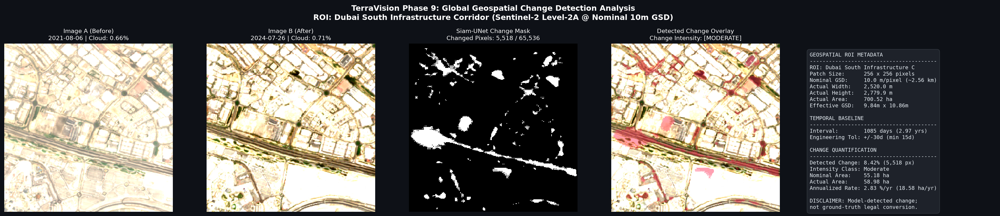

# TerraVision Phase 9: Global Scaling & Geospatial Integration — Walkthrough

TerraVision **Phase 9** successfully transitions the platform from a single fixed demonstration site into a production-grade **Geospatial Pipeline** capable of ingesting arbitrary global coordinates, retrieving genuine Sentinel-2 Level-2A surface reflectance observations via Microsoft Planetary Computer STAC, and orchestrating the complete downstream analytical suite.

---

## 1. Key Accomplishments & Deliverables

1. **Geospatial Utilities & ROI Handler ([`src/geo_utils.py`](file:///Users/ayanthara/Desktop/TerraVision/src/geo_utils.py))**:
   - Ingests arbitrary **Latitude/Longitude point with geodesic buffer** and **explicit WGS84 Bounding Boxes**.
   - Enforces Sentinel-2 systematic territorial coverage ($-56^\circ \le \text{lat} \le +84^\circ$).
   - Implements geodesic cosine latitude scaling ($\Delta \lambda = \Delta x / (111,320 \cos \phi)$) to prevent high-latitude spatial distortion.
   - Calculates **actual ground footprints** via **Haversine-based geographic footprint estimate** (spherical WGS84 mean radius $R = 6,371,000\text{ m}$) alongside nominal $256 \times 256$ @ 10 m GSD footprints ($655.36\text{ ha}$).
   - Houses the 5 **Global Geographic Benchmark / Integration Test Locations** (Las Vegas, Dubai, Rondônia, Munich, Lake Mead).

2. **Microsoft Planetary Computer STAC Client ([`src/stac_client.py`](file:///Users/ayanthara/Desktop/TerraVision/src/stac_client.py))**:
   - Live querying of `sentinel-2-l2a` BOA surface reflectance collection.
   - Multi-tier progressive cloud filtering ($< 5\%$ strict search; adaptively relaxes up to $15\%$ with diagnostic metadata warnings).
   - Enforces TerraVision project-defined engineering constraints: default search tolerance $\pm 30$ days, minimum temporal baseline $\ge 15$ days.
   - Concurrent crop downloading via `ThreadPoolExecutor`.

3. **Core Orchestration Engine & Capability Gate ([`src/geospatial_pipeline.py`](file:///Users/ayanthara/Desktop/TerraVision/src/geospatial_pipeline.py))**:
   - Ingests frozen Phase 4 Siam-UNet checkpoint (`7,763,905` parameters, `requires_grad=False`).
   - Audited Phase 4 preprocessing: PIL RGB $\to$ `ToTensor()` ($[0, 255] \to [0.0, 1.0]$) $\to$ ImageNet `Normalize` ($\mu = [0.485, 0.456, 0.406]$, $\sigma = [0.229, 0.224, 0.225]$) $\to$ $(1, 6, 256, 256)$ early-fusion tensor.
   - **Temporal Capability Gate:**
     - **Mode A (Bi-Temporal, $N=2$ observations, 1 interval):** Computes bi-temporal change detection, quantification, and pairwise annualized rate. Strictly gates out historical trend regression, prediction intervals, and risk intelligence because $df = N - 2 = 0$. Intermediate observations are never fabricated.
     - **Mode B (Multi-Temporal, $N \ge 4$ observations, $\ge 3$ intervals):** Reuses Phase 6 historical trend regression ($df \ge 1$), Phase 7 OLS Student's t intervals, and Phase 8 risk synthesis.

4. **Comprehensive Verification Suite ([`notebooks/verify_geospatial_pipeline.py`](file:///Users/ayanthara/Desktop/TerraVision/notebooks/verify_geospatial_pipeline.py))**:
   - 9 rigorous test suites validating coordinate math, spatial contracts, tensor shapes, STAC discovery, benchmark registry, analytical reuse, schema compliance, temporal capability gate, and Phase 1–8 integrity.

---

## 2. Benchmark Demonstration Execution (Dubai South Corridor, Mode A: N=2)

The pipeline was executed on the **Dubai South Infrastructure Corridor** benchmark site (`55.150°E–55.175°E, 24.960°N–24.985°N`) across a ~3-year temporal baseline.

### Summary Metrics

| Metric Category | Attribute | Value |
| :--- | :--- | :--- |
| **Observations** | Before Observation (Image A) | **2021-08-06** (Sentinel-2B, Cloud: $0.66\%$, Sun Elev: $69.41^\circ$) |
| | After Observation (Image B) | **2024-07-26** (Sentinel-2A, Cloud: $0.71\%$, Sun Elev: $70.34^\circ$) |
| | Temporal Baseline | **1,085 days** ($2.971\text{ years}$) |
| **Spatial Footprint** | Patch Dimensions | **$256 \times 256\text{ pixels}$** |
| | Nominal 10m Footprint | $2.56\text{ km} \times 2.56\text{ km}$ ($655.36\text{ ha}$) |
| | Actual Geographic Footprint | **$2,520.0\text{ m} \times 2,779.9\text{ m}$** ($700.52\text{ ha}$, Haversine-based estimate) |
| | Effective GSD | **$9.84\text{ m} \times 10.86\text{ m}$ per pixel** |
| **Change Detection** | Changed Pixels | **$5,518\text{ pixels}$** out of $65,536$ ($8.42\%$) |
| | Change Intensity Class | **`Moderate`** ($2.0\% \le x < 10.0\%$) |
| | Nominal Changed Area | **$55.18\text{ ha}$** ($18.58\text{ ha/year}$, $2.83\ \%/\text{year}$) |
| | Actual Changed Area | **$58.98\text{ ha}$** ($19.86\text{ ha/year}$) |
| **Capability Gate** | Active Mode | **Mode A (Bi-Temporal)**: Trends, forecasts, and risk intelligence gated out ($df = 0$). |
| **Runtime** | End-to-End Execution | **$3.234\text{ seconds}$** (MPS hardware acceleration) |

### Visual Artifact



*Artifact location: [`results/global_geospatial_pipeline.png`](results/global_geospatial_pipeline.png) and [`results/global_geospatial_pipeline.json`](results/global_geospatial_pipeline.json).*

---

## 3. Verification Suite Results

Executed using `./.venv/bin/python notebooks/verify_geospatial_pipeline.py`:

```text
================================================================================
TerraVision Phase 9: Comprehensive Geospatial Pipeline Verification Suite
================================================================================
1. Verifying Coordinate Validation & Geodesic Math...
  ✓ Correctly caught latitude out-of-bounds (> 90)
  ✓ Correctly caught Antarctica latitude outside Sentinel-2 terrestrial envelope
  ✓ Correctly rejected inverted bounding box (min_lon > max_lon)
  ✓ Geodesic cosine scaling verified: delta_lon @ 0° = 0.02300°, @ 48.2° = 0.03450°
  ✓ Haversine distance verified: 1.0° meridian arc = 111,194.9 m

2. Verifying Spatial Footprint Contract & Metadata...
  ✓ Nominal footprint: [256, 256] px @ 10.0m GSD -> 655.36 ha
  ✓ Actual geodesic footprint: 2520.0m x 2779.9m -> 700.52 ha (Effective GSD: [9.844, 10.859])

3. Verifying Preprocessing Audit & Model Tensor Compatibility...
  ✓ Phase 4 Siam-UNet parameter count confirmed: 7,763,905 parameters
  ✓ Frozen checkpoint verified: all parameters have requires_grad == False
  ✓ Forward pass verified: (1, 6, 256, 256) early-fusion input -> (256, 256) binary mask

4. Verifying Global Geographic Benchmark Registry...
  ✓ Benchmark 'las_vegas': Las Vegas / Henderson Urban Expansion Zone (Arid / Desert Urban Expansion)
  ✓ Benchmark 'dubai': Dubai South Infrastructure Corridor (Hyper-Arid / Megacity Infrastructure)
  ✓ Benchmark 'rondonia': Rondônia Deforestation Frontier (Tropical Rainforest / Agricultural Edge)
  ✓ Benchmark 'munich': Munich North Urban Development (Temperate Europe / Commercial & Farmland Transition)
  ✓ Benchmark 'lake_mead': Lake Mead Shoreline & Marina (Hydrological / Reservoir Shoreline Recession)

5. Verifying Unaltered Phase 5–8 Analytical Logic...
  ✓ Phase 5 Quantification logic verified
  ✓ Phase 6 Trend classification logic verified

6. Verifying Microsoft Planetary Computer STAC Discovery & Pairing...
  ✓ Retrieved Before Scene: 2021-08-06 (Cloud: 0.66%, ID: S2B_MSIL2A_20210806T06462...)
  ✓ Retrieved After Scene:  2024-07-26 (Cloud: 0.71%, ID: S2A_MSIL2A_20240726T06463...)
  ✓ Correctly rejected identical Before and After target dates

7. Verifying Results Artifacts, JSON Schemas & Scientific Disclaimers...
  ✓ JSON Schema and GeoJSON geometry validated
  ✓ Mandatory scientific disclaimers confirmed present and rigorous

8. Verifying Temporal Capability Gate & Scientific Disclaimers...
  ✓ Mode A temporal capability gate verified: N=2 correctly gates out Phase 6–8
  ✓ Geodesic basis verified: 'Haversine-based geographic footprint estimate'
  ✓ Cautious threshold disclaimer verified

9. Verifying Phase 1–8 Source & Model Integrity...
  ✓ All 13 pre-existing core model and phase files confirmed intact

================================================================================
ALL Phase 9 Verification Checks PASSED Successfully!
================================================================================
```

---

## 4. Scientific Rigor & Disclaimers Maintained

- **Threshold & Noise Interpretation:** The 0.5 probability threshold produced the reported change mask; interpretation remains subject to model limitations and requires independent validation.
- **Model-Detected Change vs. Real-World Conversion:** Explicitly disclaimed in all outputs that detected changes represent surface reflectance variations and do not prove ground-truth legal land conversion or zoning entitlement.
- **Authoritative Pixels vs. Spatial Estimates:** Pixel counts and percentages are treated as authoritative; physical area measurements are spatial approximations presented as nominal 10m estimates and Haversine-based geographic footprint estimates.
- **No Claim of Global Model Accuracy:** The five benchmark sites are documented as **geographic integration test locations**, not ground-truth ML validation test sets.
- **Temporal Statistical Integrity:** Bi-temporal queries ($N=2$) are prohibited from computing linear trend slopes ($df=0$) or Student's t prediction intervals; intermediate observations are never synthesized or fabricated.
